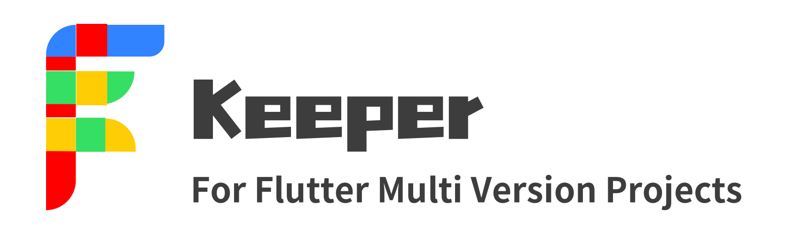
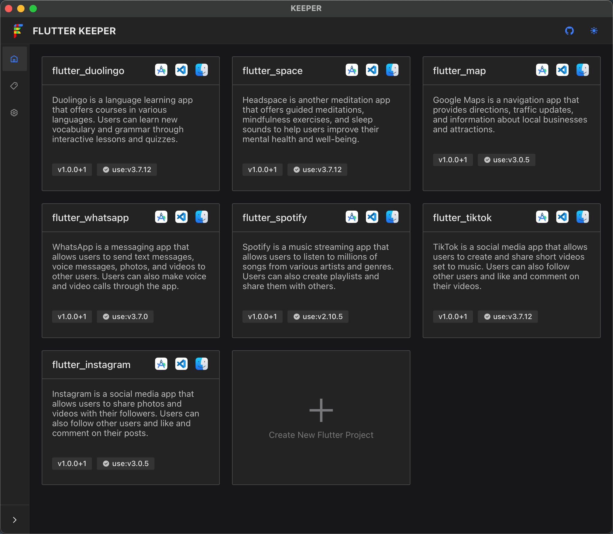
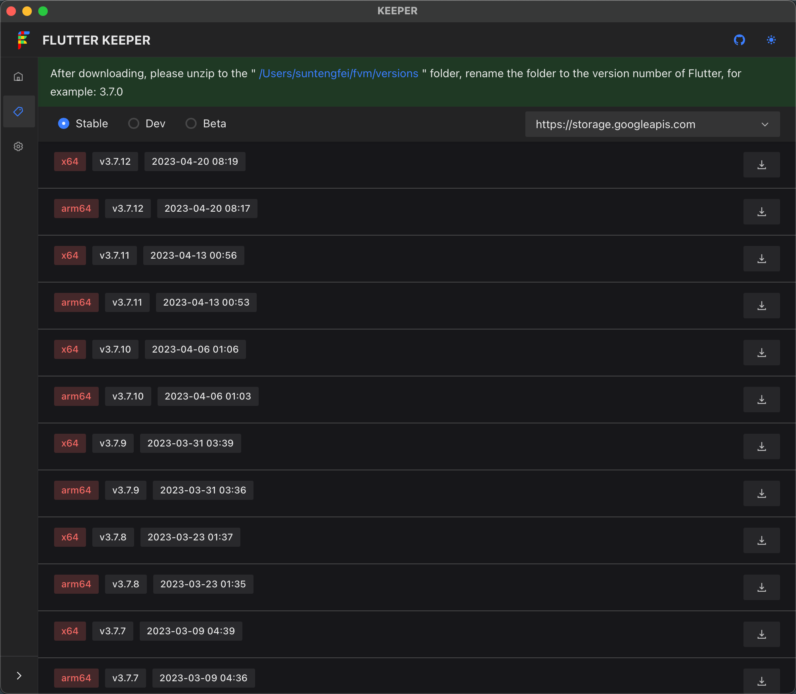

<h1 align="center">

</h1>

    <a href="./README-CN.md">中文介绍</a> | English

    <em>开源的 Flutter多版本项目管理工具 桌面客户端，超小的安装包，支持 Windows、Mac 和 Linux</em>

<table>
<tr>
<td>

</td>
<td>

</td>
</tr>
</table>

## 特性

- 项目的统一管理
- SDK的统一管理
- 打开项目时自动切换到指定版本
- 可视化的项目创建
- 免费，开源

## 下载

*Keeper 支持所有的主流操作系统，包括： Windows、 Mac (Intel, M1) 和 Linux。*

### 从 Github Releases 下载

您可以访问 **[Github Releases](https://github.com/WuJiuYou/flutter-keeper/releases)** 浏览并下载所有历史版本。

## 为什么需要 Keeper？

- Keeper 可视化的多版本Flutter项目管理
- Keeper 帮助你轻松下载SDK，分类更合理，省去查找的麻烦
- Keeper 轻松在不同sdk版本中随时切换

## Roadmap

- [x] 项目的统一管理
- [x] SDK的统一管理
- [x] 打开项目时自动切换到指定版本
- [x] 可视化的项目创建
- [ ] 支持文件自定义打开方式
- [ ] 支持自动应用内下载SDK并解压到指定目录中
- [ ] 支持自动配置环境变量
- [ ] 支持应用内打开第三方站点
- 更多...

## Star History

